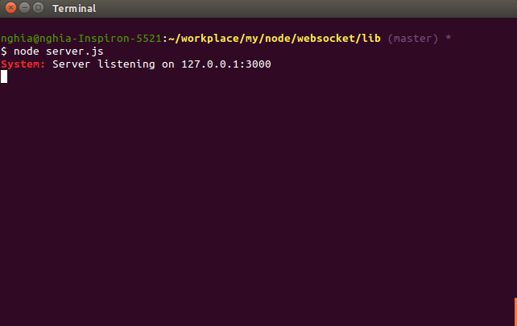
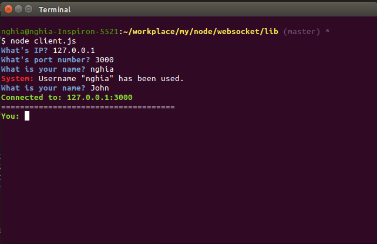
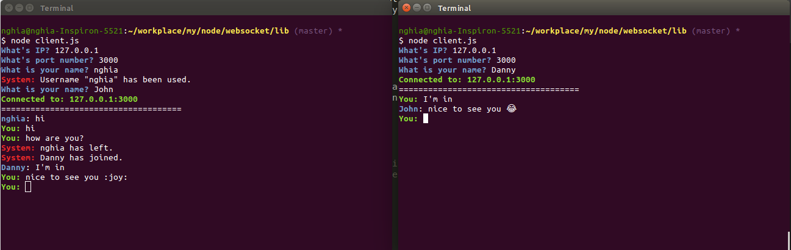
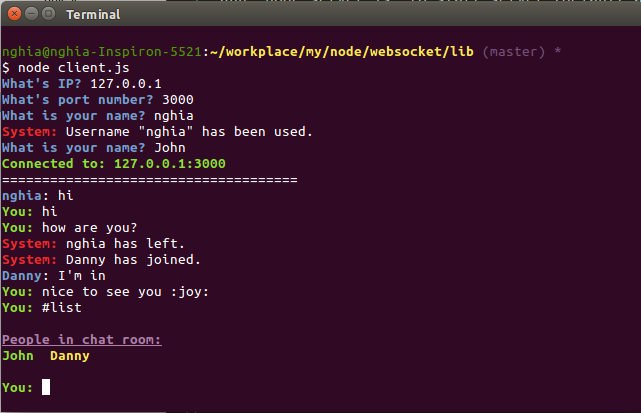
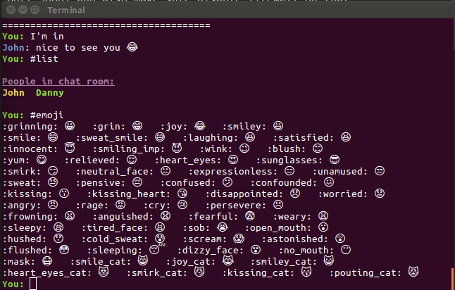

# termchat

## WORK IN PROGRESS

If you want to see how it works for now, clone the repo and go to the /lib directory. Make sure you run `npm install` to install all dependencies first.

### Run as server

Run `node server.js` to start server (default at port 3000) and also make sure disable firewall on that port so that other users can see access it. Or you can change port number in server.js to 80 and run it as root.



### Run as client

Run `node client.js`. Then, it will ask for ip address, and port number of the server you want to connect to. After that you have to insert your display name. This name must be unique so if someone already used it, it will ask you again.



Then, you can start the conversation.



## Commands

Run `#list` to see all people in the chat room



Run `#emoji` to see all supported emoji icons



And Ctrl + C to exit

<!-- [![NPM version][npm-image]][npm-url] [![Build Status][travis-image]][travis-url] [![Dependency Status][daviddm-image]][daviddm-url] [![Coverage percentage][coveralls-image]][coveralls-url]

## Installation

```
  npm install --save termchat
```

## Usage

```js
var termchat = require('termchat');
``` -->

## Getting To Know Yeoman

Yeoman has a heart of gold. He&#39;s a person with feelings and opinions, but he&#39;s very easy to work with. If you think he&#39;s too opinionated, he can be easily convinced. Feel free to [learn more about him](http://yeoman.io/).

## Created with
[Yeoman](https://npmjs.org/package/yo) and [Generator-simple-package](https://npmjs.org/package/generator-simple-package)

## License
MIT © [NghiaTTran]()

[npm-image]: https://badge.fury.io/js/termchat.svg
[npm-url]: https://npmjs.org/package/termchat
[travis-image]: https://travis-ci.org/nghiattran/termchat.svg?branch=master
[travis-url]: https://travis-ci.org/nghiattran/termchat
[daviddm-image]: https://david-dm.org/nghiattran/termchat.svg?theme=shields.io
[daviddm-url]: https://david-dm.org/nghiattran/termchat
[coveralls-image]: https://coveralls.io/repos/nghiattran/termchat/badge.svg
[coveralls-url]: https://coveralls.io/github/nghiattran/termchat
